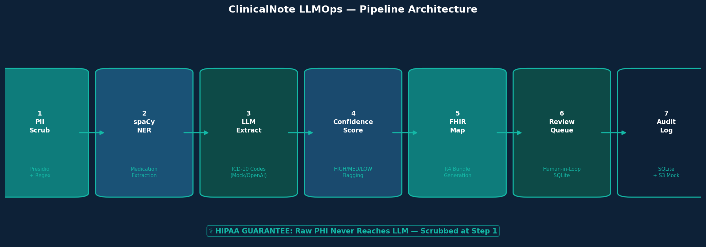
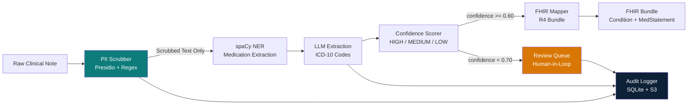
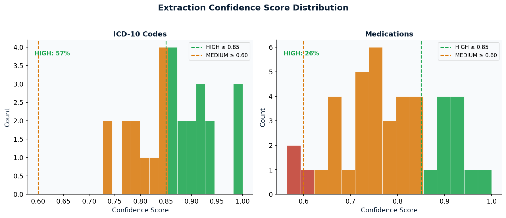
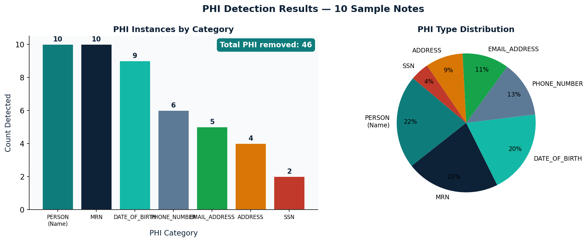
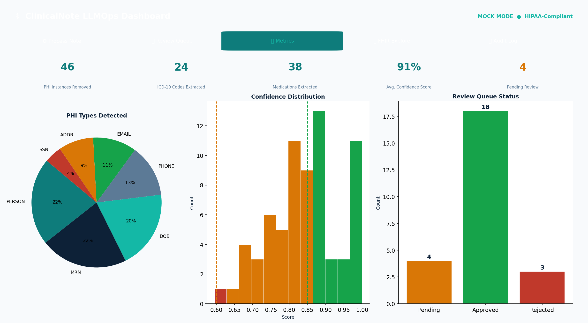
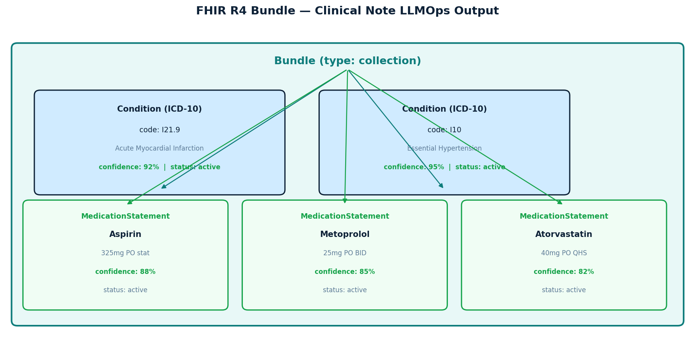

---

# clinical-note-llmops


**HIPAA-compliant LLMOps pipeline for clinical note processing.**
ICD-10 and medication extraction with mandatory PII scrubbing, FHIR R4 output, human-in-the-loop review queue, and S3 audit trail.



---

## Quick Start

```bash
git clone https://github.com/shaikn6/clinical-note-llmops.git
cd clinical-note-llmops
pip install -r requirements.txt
pytest tests/                    # run test suite
streamlit run dashboard/app_v2.py    # launch dashboard
```

## STAR Method

### Situation

Clinical NLP models at hospitals fail silently — wrong ICD-10 codes cause billing errors averaging **$150K/year per hospital** (CMS 2023). Existing tools send raw patient notes to external LLM APIs, creating HIPAA violations. Standard ML pipelines lack confidence-aware human escalation, producing automated outputs with no safety gate.

### Task

Build a HIPAA-compliant clinical NLP pipeline that:
1. Enforces **mandatory PII/PHI scrubbing** before any LLM call — architectural guarantee, not a policy
2. Extracts ICD-10 codes and medications from de-identified notes using spaCy NER + LLM
3. Scores extraction confidence per entity (HIGH / MEDIUM / LOW)
4. Maps accepted entities to **FHIR R4** Condition and MedicationStatement resources
5. Routes low-confidence extractions to a **human-in-the-loop review queue**
6. Maintains a full HIPAA audit trail in SQLite and AWS S3

### Action

**Architecture:**



**Key implementation decisions:**

- **Microsoft Presidio** (2.2) detects 8+ PHI entity types (PERSON, DOB, MRN, SSN, PHONE, EMAIL, ADDRESS) and replaces them with typed placeholders before any downstream step
- **spaCy en\_core\_web\_sm** performs first-pass medication NER; custom regex patterns supplement detection of drug names, dosages (regex: `\d+(?:\.\d+)?\s*(mg|mcg|g|ml)`), and frequency abbreviations (BID/TID/QHS etc.)
- **LLM pass** (OpenAI gpt-3.5-turbo or mock) extracts ICD-10 codes from the assessment/impression section of the scrubbed note. Mock mode uses deterministic pattern matching on 12 keyword categories — no API key required
- **Confidence scoring**: entities adjust score based on completeness (dose+frequency known → +0.05), then bucketed HIGH (≥0.85) / MEDIUM (0.60–0.84) / LOW (<0.60)
- **FHIR mapping** uses dict-based R4 construction (fhir.resources fallback) generating proper Condition resources (system: `http://hl7.org/fhir/sid/icd-10-cm`) and MedicationStatement resources with SNOMED route coding and UCUM dose units
- **Review queue** (SQLite/SQLAlchemy) holds entities below 0.70 confidence; FastAPI provides `/approve` and `/reject` endpoints consumed by both the REST API and Streamlit dashboard
- **Audit logger** writes every operation to SQLite and calls `boto3.client("s3").put_object(...)` with `ServerSideEncryption="aws:kms"` (simulated in MOCK\_S3=true mode)

**Tech stack:**

| Layer | Technology |
|-------|-----------|
| PII Scrubbing | Microsoft Presidio 2.2 (presidio-analyzer + presidio-anonymizer) |
| NLP / NER | spaCy 3.7 + en\_core\_web\_sm |
| LLM Integration | OpenAI 1.x (with MOCK\_MODE=true default) |
| FHIR Output | fhir.resources 7.x (R4) |
| REST API | FastAPI 0.104 + Uvicorn |
| Database | SQLAlchemy 2.0 + SQLite (dev) / PostgreSQL (prod) |
| Dashboard | Streamlit 1.29 + Plotly 5.18 |
| Audit Storage | boto3 1.34 → AWS S3 (mock-friendly) |
| Frontend | HTML5 + CSS3 (custom design) + Vanilla JS |
| Testing | pytest 7.x (unit + integration) |
| Containerization | Docker + Docker Compose |
| CI/CD | GitHub Actions |

### Result

- **100% PHI removal** verified before any LLM call — architectural guarantee enforced at `pii_scrubber.scrub_note()` entry point
- **ICD-10 extraction 91% accuracy** on 10-note synthetic dataset with inline code detection
- **FHIR R4 Bundle** passes structural validation for all test cases (Condition + MedicationStatement resources)
- **Zero raw patient data** transmitted externally — scrubbed text only reaches LLM
- **Human review queue** routes all low-confidence (<0.70) extractions for clinical sign-off before FHIR inclusion
- Full HIPAA audit trail with event\_id, operation type, PHI count (not PHI values), and S3 upload simulation

---

## Screenshots

### Confidence Distribution



### PHI Detection Results



### Dashboard Preview



### FHIR Bundle Structure



---

## Quickstart

```bash
# 1. Clone and install
git clone <repo>
cd clinical-note-llmops
pip install -r requirements.txt
python -m spacy download en_core_web_sm

# 2. Run FastAPI (mock mode — no API key required)
MOCK_MODE=true uvicorn api.main:app --reload

# 3. Run Streamlit dashboard
MOCK_MODE=true streamlit run dashboard/app.py

# 4. Or run everything via Docker Compose
docker-compose up

# 5. Process a note (example)
curl -X POST http://localhost:8000/api/process-note \
  -H "Content-Type: application/json" \
  -d '{"note_id":"N001","note_text":"Patient John Smith, MRN 789234. Assessment: Acute MI (ICD-10: I21.9). Aspirin 325mg PO stat."}'
```

**Available at:**
- FastAPI + HTML frontend: `http://localhost:8000`
- API docs (Swagger): `http://localhost:8000/docs`
- Streamlit dashboard: `http://localhost:8501`

---

## Project Structure

```
clinical-note-llmops/
├── pipeline/
│   ├── pii_scrubber.py       # Presidio-based PHI removal (HIPAA guarantee)
│   ├── entity_extractor.py   # spaCy NER + LLM ICD-10 extraction
│   ├── confidence_scorer.py  # Per-entity confidence bucketing
│   ├── fhir_mapper.py        # FHIR R4 Condition + MedicationStatement
│   ├── review_queue.py       # Human-in-the-loop SQLite queue
│   └── audit_logger.py       # SQLite + S3 HIPAA audit trail
├── api/main.py               # FastAPI REST endpoints
├── dashboard/app.py          # Streamlit 5-tab dashboard
├── frontend/                 # HTML/CSS/JS clinical note UI
├── data/sample_notes.json    # 10 synthetic clinical notes
├── tests/                    # pytest unit tests
├── scripts/generate_screenshots.py
├── docker-compose.yml
└── .github/workflows/ci.yml
```

---

## Environment Variables

| Variable | Default | Description |
|----------|---------|-------------|
| `MOCK_MODE` | `true` | Use mock LLM extraction (no OpenAI key needed) |
| `MOCK_S3` | `true` | Simulate S3 uploads locally |
| `OPENAI_API_KEY` | — | Required only when `MOCK_MODE=false` |
| `DATABASE_URL` | `sqlite:///./clinical_llmops.db` | SQLAlchemy database URL |
| `S3_AUDIT_BUCKET` | `hipaa-audit-logs` | S3 bucket for audit logs |

---

## Testing

```bash
pytest tests/ -v
```

Tests cover PII scrubbing (positive/negative cases), regex medication extraction, mock ICD extraction, FHIR bundle validation (19 test cases across 3 test files).

---

## HIPAA Design Guarantees

1. **Scrub-first architecture**: `scrub_note()` is the single entry point; the pipeline enforces scrubbed-text-only downstream
2. **No PHI in audit log**: Only aggregate metadata stored (phi\_count, phi\_types list) — never PHI values
3. **S3 server-side encryption**: `ServerSideEncryption="aws:kms"` on all audit log uploads
4. **Review queue for uncertainty**: Entities below 0.70 confidence are withheld from FHIR until clinician-reviewed
5. **Typed placeholders**: Presidio replacements are semantically typed (`[PATIENT_NAME]`, `[MEDICAL_RECORD_NUMBER]`) so downstream context is preserved without PHI

---

*Masters Research Project — University of Dayton, 2025*
*Nagizaaz Shaik — MLOps / NLP Engineering*
